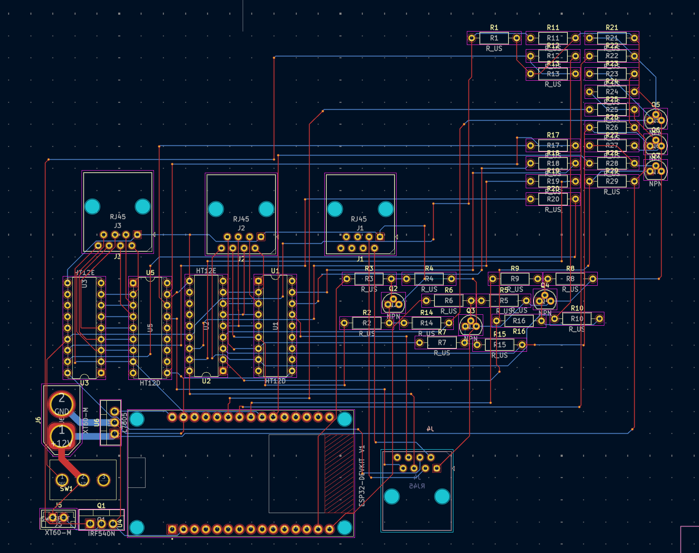
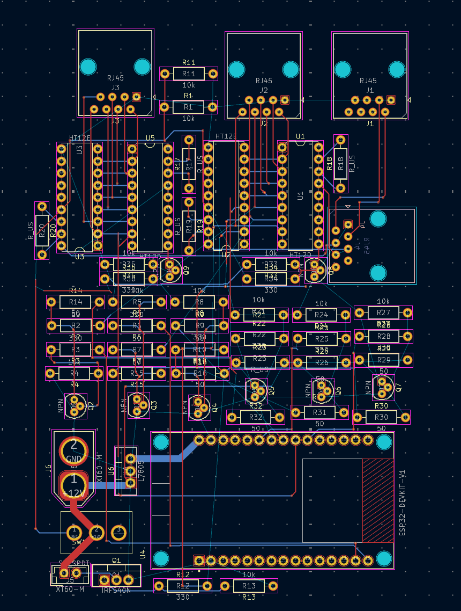
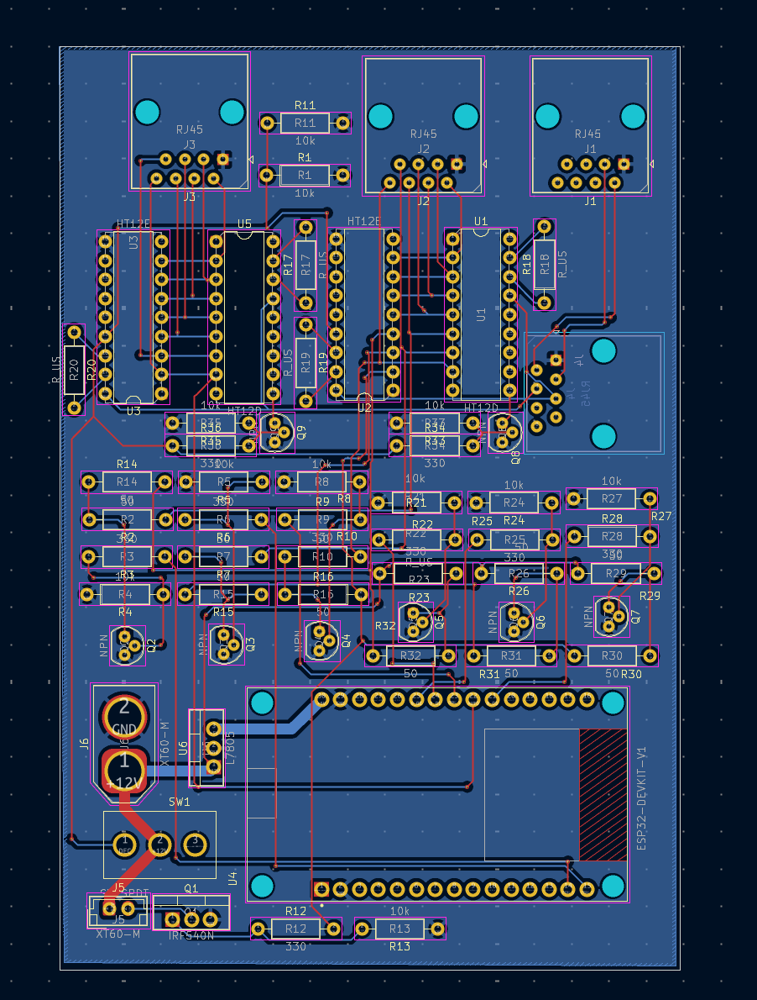

### 5/15
Time Spent: ~3 hours  

Today, I finished placing all major components on the custom PCB for our rocket ground control system. This includes the ESP32, RJ45 ports for signal transmission, HT12E/HT12D encoder-decoder chips, NPN transistors for valve/igniter control, and the L7805 voltage regulator. I also added XT60 connectors for power input and set up resistor arrays for signal conditioning. The board layout is organized, but routing and zone fills still need to be done.

### 5/20
Time Spent: ~2.5 hours  
Today, I completed all the signal and power routing on the PCB. All connections between the ESP32, RJ45 ports, HT12E/HT12D chips, transistor drivers, and supporting components are now fully traced. I also finalized placement and routing for the resistor networks and MOSFET power stage. The layout is compact and clean, with minimal via usage and clear signal paths. Next, I’ll focus on ground pours, silkscreen adjustments, and a final DRC pass before generating Gerber files.

### 5/26
Time Spent: ~2 hours  
Today, I cleaned up and reorganized the PCB layout for better routing and clarity. I rearranged the HT12E/HT12D chips and resistor arrays to simplify connections between the RJ45 ports and ESP32. The power section was tightened up around the XT60 and MOSFET, and routing is now more efficient with fewer vias. Ground fills and labeling are next.

## 6/8
Time Spent: ~2 hours  
After a very hectic school schedule, I resumed my project. Today, I added a proper board outline and fit the whole layout into it. Before this, everything was just floating without a defined shape. I also poured the ground plane across the board, which really cleaned up the power and signal return paths, especially around the ESP32 and transistor section. I also tweaked a few traces for better spacing near the HT12 chips and drivers. It’s finally starting to look like a real, finished board. I need to tidy up the silkscreen and run a final DRC check before generating Gerbers.

