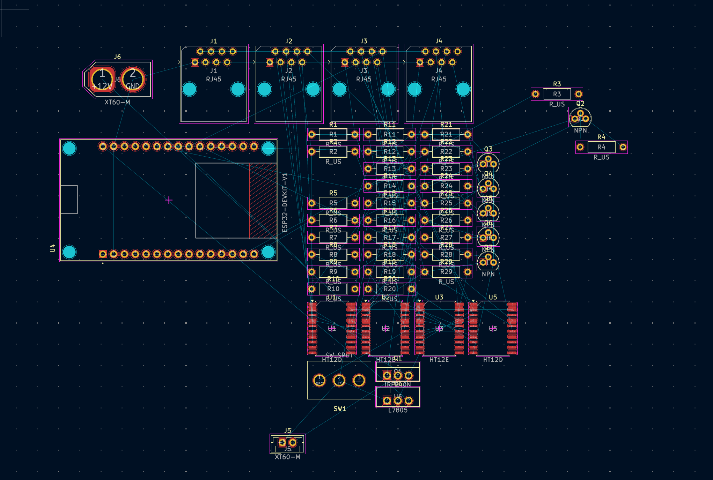

### 5/15
Time Spent: ~3 hours  

Today, I finished placing all major components on the custom PCB for our rocket ground control system. This includes the ESP32, RJ45 ports for signal transmission, HT12E/HT12D encoder-decoder chips, NPN transistors for valve/igniter control, and the L7805 voltage regulator. I also added XT60 connectors for power input and set up resistor arrays for signal conditioning. The board layout is organized, but routing and zone fills still need to be done.

