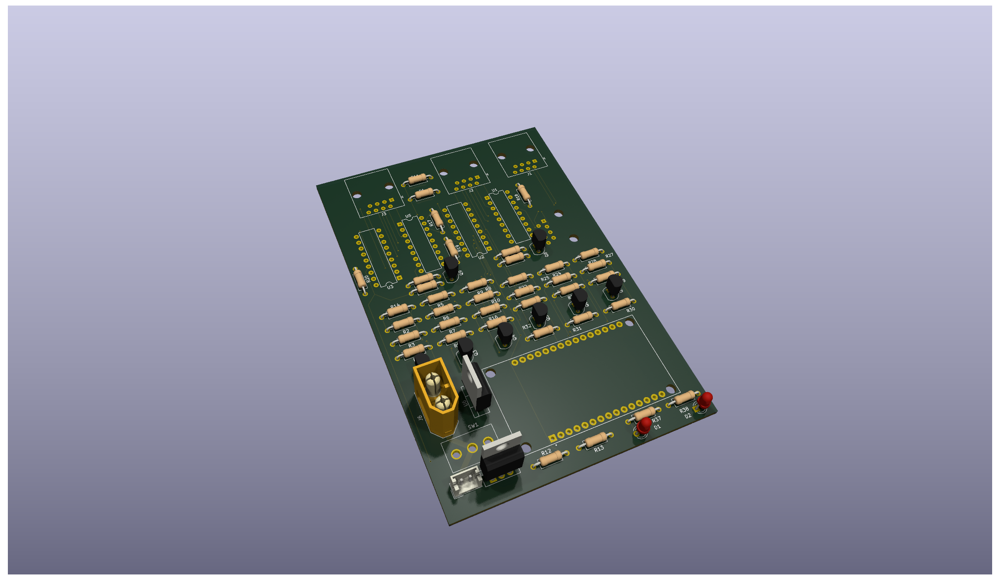
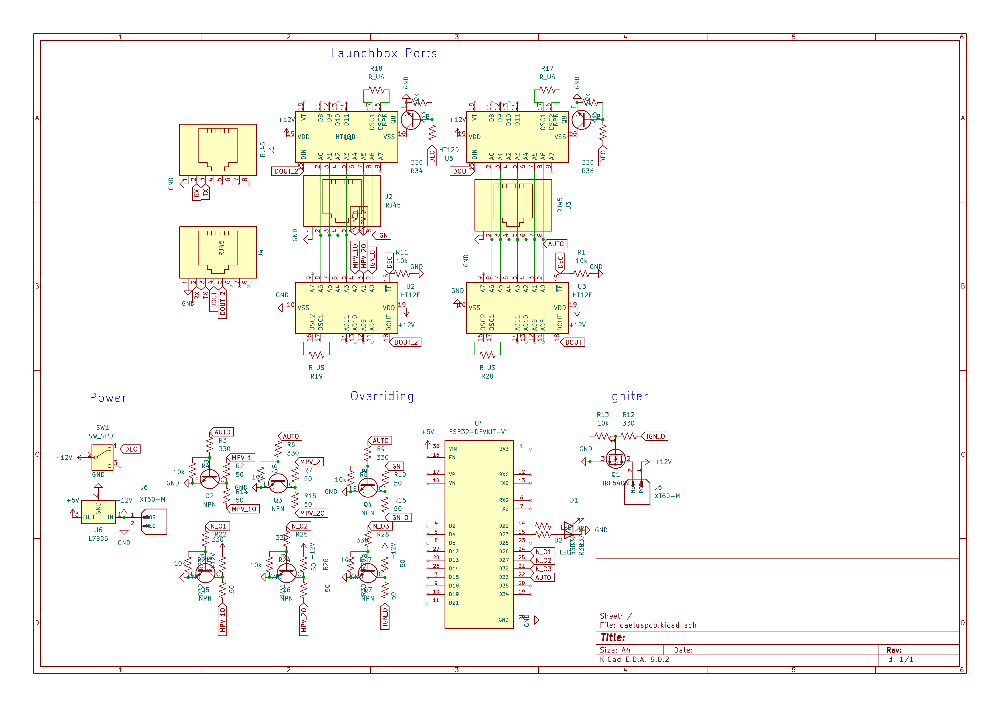
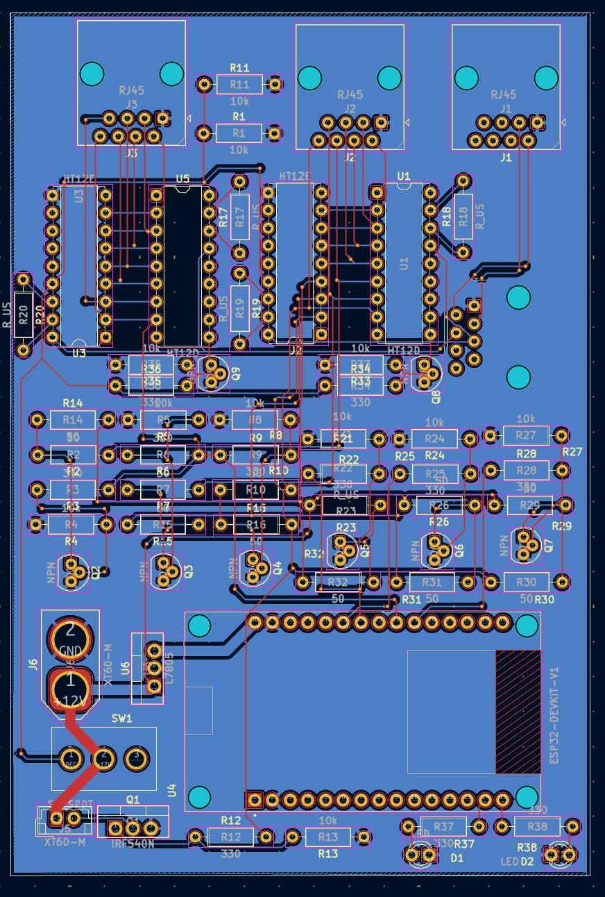

## Project Caelus Encoder PCB

Caelus Rocketry is an aerospace nonprofit consisting entirely of high school students. Our goal is to design, build, test, and launch the first high schooler-built bipropellant liquid-fueled rocket to the edge of space. The EncoderPCB allows us to 

## 3D Render of PCB

## Circuit Diagram of PCB

## Close up shot of PCB

## Bill of Materials (BOM)

| Component                    | Quantity  | JLCPCB Estimate  |
|------------------------------|-----------|------------------|
| PCB                          | 1         | $7.90            |

